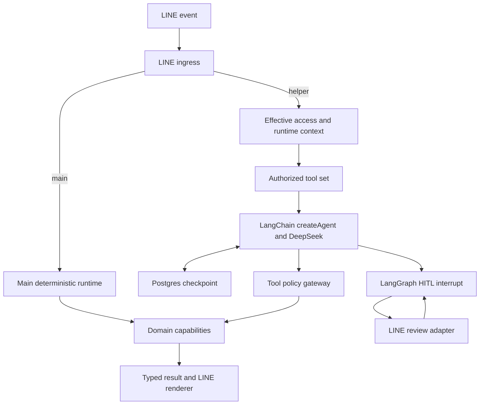

# Helper agent greenfield runtime design

Date: 2026-09-04
Status: approved in conversation; awaiting implementation-plan review
Baseline: `origin/main` at `9110b9e2784cfb39ddbf57fdbb0a8d63b65747f7`

This design supersedes the future architecture direction in
`2026-09-04-sdk-agent-redesign-analysis.md`. PR #76 introduced the first
LangChain SDK agent and removed the former planner/validator runtime. This
design completes that transition by replacing the remaining mixed helper
orchestration with one LangChain agent runtime and removing the legacy
compatibility architecture. The `main` profile may be reorganized internally;
its user-visible behavior and provider-free contract must remain unchanged.

## 1. Product decision

`helper` is a conversational church assistant. It may answer ordinary
conversation naturally. Any external data, official church information, or
side-effecting action must use an allowlisted tool and pass server-owned
policy.

The model may understand intent, select and sequence tools, ask focused
questions, and combine bounded evidence. It never grants permission, confirms
its own write, declares a stored note official, or determines whether an
external file is safe.

The two primary product constraints are:

1. Forbidden or unauthorized actions must not execute, even if the model asks
   for them or untrusted content contains instructions.
2. Normal LINE conversations must not spend unnecessary model calls or send
   unbounded history and tool output to DeepSeek.

## 2. Goals

- Give `helper` one standard agent loop with natural follow-up, clarification,
  multi-tool reasoning, checkpointed context, and guarded writes.
- Make current/latest data the server-side default for omitted date or version
  arguments.
- Keep official schedules, saved notes, knowledge, and public sources visibly
  distinct.
- Use LangChain and LangGraph facilities for the agent loop, checkpointing,
  context editing, summarization, call limits, and human review.
- Remove the remaining legacy routing, generic slot collection, pending
  resolution, turn-stage state machine, duplicate registries, and compatibility
  facades from production code.
- Preserve `main` behavior while allowing its implementation to be simplified.
- Preserve the proven Account, storage, publication, scan, audit, and
  idempotency boundaries.
- Produce privacy-safe usage evidence for model calls, tokens, tool calls,
  context compression, outcomes, and latency.

## 3. Non-goals

- No shell, arbitrary HTTP, arbitrary SQL, generic browser, or filesystem tool.
- No subagents, planner agent, model-based tool selector, shadow router, or
  second semantic provider.
- No automatic group-chat recording or named-member profiling.
- No automatic conversion of saved notes into official schedules.
- No new microservice, hosted agent platform, LangSmith dependency, or MCP
  server in the first implementation.
- No binary download, malware scanning, or publication inside the bot process.
- No destructive removal of historical migrations in the rewrite PR.

## 4. Framework decision

Use LangChain JS `createAgent`, `@langchain/deepseek`, and LangGraph's
PostgreSQL checkpointer.

LangChain is selected because this product needs more than a tool loop:

- durable, requester-scoped threads across LINE events;
- human-in-the-loop pause and resume;
- model/tool call limits;
- clearing old tool results;
- persistent conversation summarization;
- middleware hooks around model and tool calls.

Vercel AI SDK's `ToolLoopAgent` is a valid smaller loop and has a direct
DeepSeek provider. It would require this project to implement more persistence,
summarization, and cross-event review behavior. Mastra and Deep Agents add
workflow, filesystem, or subagent surface that is unnecessary here. OpenAI
Agents SDK can use non-OpenAI providers through adapters but gives no advantage
for this DeepSeek-only service.

Use the framework's standard agent graph. Do not build a hand-written semantic
LangGraph around it.

References:

- [LangChain agents](https://docs.langchain.com/oss/javascript/langchain/agents)
- [LangChain middleware](https://docs.langchain.com/oss/javascript/langchain/middleware/built-in)
- [LangChain human-in-the-loop](https://docs.langchain.com/oss/javascript/langchain/human-in-the-loop)
- [LangGraph persistence](https://docs.langchain.com/oss/javascript/langgraph/persistence)
- [AI SDK DeepSeek provider](https://ai-sdk.dev/providers/ai-sdk-providers/deepseek)

## 5. Target architecture



### 5.1 LINE ingress

The ingress layer performs the work that must happen without a model call:

- canonical profile path selection;
- LINE signature validation;
- webhook event deduplication;
- direct/group/room access policy;
- registration and public slash commands;
- group wake-word and requester checks;
- postback verification;
- dispatch to `main`, `helper`, or admin behavior.

Ingress does not infer semantic function intent. An accepted helper text turn
goes directly to the helper agent.

### 5.2 Main runtime

`main` is a small deterministic dispatcher. Its internal implementation may be
rewritten and may share transport, authorization, confirmation, action
execution, and domain services with `helper`.

The following behavior is invariant:

- public direct chat remains available;
- groups remain blocked;
- Weekly Paper download remains available;
- linked callers can update their own first/last name through the same slot,
  preview, live Account authorization, and confirmation behavior;
- public help, identity, and Account login behavior remain compatible;
- canonical webhook paths and LINE reply/postback contracts remain compatible;
- `main` produces zero DeepSeek and zero embedding requests.

No legacy generic runtime may remain solely to preserve the implementation of
these two main functions.

### 5.3 Helper agent runtime

The helper runtime owns only:

- the system prompt and trusted runtime context;
- dynamic construction of the authorized tool set;
- the standard `createAgent` invocation;
- checkpoint/thread lifecycle;
- framework middleware;
- mapping interrupts and typed results to LINE responses.

It does not contain capability-specific routing branches, date rules, storage
queries, or publication logic.

### 5.4 Tool policy gateway

Every helper tool executes through one gateway. The gateway:

1. validates a strict Zod schema;
2. resolves current profile, source, requester, and Account authorization;
3. rechecks that the requested operation is enabled;
4. enforces allowed source and side-effect policy;
5. applies per-tool timeout, call, and result-size limits;
6. calls the domain capability;
7. projects a bounded typed result;
8. records privacy-safe usage metadata.

Authorization is checked when tools are constructed and immediately before
each execution. Checkpoint history never expands authority.

## 6. Tool catalog

Expose separate tools for data with different authority. The clarity gained is
more valuable than saving a few tool-schema tokens by grouping unrelated
sources.

### 6.1 Normal read tools

| Agent tool              | Domain capability  | Contract                                                                                  |
| ----------------------- | ------------------ | ----------------------------------------------------------------------------------------- |
| `get_official_schedule` | `query_schedule`   | Formal canonical schedule. Omitted period/version means the latest valid record at `now`. |
| `find_presentation`     | `find_ppt_slides`  | Authorized presentation catalog only.                                                     |
| `find_sheet_music`      | `find_sheet_music` | Internal pop/hymn sheet-music catalog.                                                    |
| `find_resource`         | `find_resource`    | Authorized general church resources.                                                      |
| `search_knowledge`      | `query_knowledge`  | Registered knowledge sources; never a formal schedule.                                    |
| `search_saved_notes`    | `retrieve_memory`  | Explicit visible memories; never a formal schedule.                                       |
| `query_wikipedia`       | `query_wikipedia`  | Bounded Wikipedia factual lookup.                                                         |

### 6.2 Write tools

| Agent tool              | Domain capability | Contract                                                                            |
| ----------------------- | ----------------- | ----------------------------------------------------------------------------------- |
| `propose_save_schedule` | `save_schedule`   | Full proposal followed by review; no confirmation field in model schema.            |
| `propose_save_memory`   | `save_memory`     | Explicit memory proposal with visibility and expiry review.                         |
| `propose_save_resource` | `save_resource`   | Authorized resource or attachment proposal; final binary work remains outbox-owned. |

Write tools are visible only to callers that may propose the operation. The
tool still reauthorizes before execution.

### 6.3 Consented sheet-music research tools

After internal search misses and the requester explicitly consents, add only:

- `search_sheet_music_web`;
- `read_sheet_music_page`.

The research turn receives no admin tools and no unrelated write tools. A
direct PDF/JPEG/PNG candidate may create a `propose_save_resource` review only
through the dedicated import boundary. It is never downloaded by the agent or
bot process.

### 6.4 Typed results

Read tools return a common envelope:

```ts
type ToolResult<T> = {
  status: "success" | "not_found" | "ambiguous" | "unavailable" | "denied";
  sourceType: "official" | "knowledge" | "saved_note" | "public";
  asOf?: string;
  revision?: string;
  freshness?: "fresh" | "stale";
  data?: T;
  clarification?: string;
};
```

Temporary sharing links and other authoritative LINE payloads remain outside
checkpointed model evidence. The transport uses the domain result directly for
buttons, files, links, write previews, and terminal write status.

## 7. Freshness and ambiguity

Freshness is a domain rule, not a prompt convention.

- An omitted schedule period resolves to the current/latest active canonical
  schedule.
- An omitted catalog version searches the latest atomically published
  revision.
- A source reports `fresh`, `stale`, `unavailable`, or `not_found`; it does not
  collapse unavailable into not-found.
- Saved notes always report `sourceType: saved_note` and cannot satisfy an
  official-schedule result.
- The agent asks a question only when the domain returns genuine ambiguity or
  a required business value has no safe default.
- Tool descriptions and system policy require a tool before stating current or
  internal facts.

For example, `查服事表` calls `get_official_schedule` with no fabricated date;
the server selects the latest valid schedule. A note containing a roster may be
offered as a separately labeled note only when useful.

## 8. Context and memory

### 8.1 Context layers

Each model request contains only:

1. concise persona and safety instructions;
2. trusted current time, source type, and available capability names;
3. requester-scoped recent checkpoint messages;
4. bounded tool results;
5. the current user message.

Do not put raw LINE IDs, secrets, Account records, confirmation nonces, or full
group history into the prompt.

Thread IDs are HMAC-derived from `(profile, source type/id, requester user id)`.
Different members of one group have independent threads. A group/room event
without a requester user ID does not invoke the agent.

### 8.2 Thread lifetime

- Direct chat idle TTL: 30 minutes.
- Group/room idle TTL: 15 minutes.
- Cleanup interval: 5 minutes.
- A successful accepted turn refreshes its idle expiry.
- A persona, memory policy, safety policy, or tool-contract version change
  invalidates the old thread before the next model call.
- `/reset` and `忘記這段對話` delete only the requester's current short-term
  checkpoint.

Production uses `PostgresSaver` and serializes same-thread execution across
replicas. Local tests may use `MemorySaver` explicitly.

### 8.3 Context budget

Apply the following initial product budgets:

| Limit        |                    Normal turn | Consented sheet-music research |
| ------------ | -----------------------------: | -----------------------------: |
| Model calls  |                              4 |                              6 |
| Tool calls   |                              4 |                              6 |
| Model output |                     800 tokens |                     800 tokens |
| Tool result  | 2,000 characters or 10 records | 2,000 characters or 10 records |

Normal expected behavior is one model call for conversation and two model
calls for a one-tool query. The limits are ceilings, not targets.
Every DeepSeek request counts against the run budget, including summarization
and transport retries; middleware-internal calls are not exempt. Keep the
combined tool names, descriptions, and schemas below an initial 2K-token
prompt budget and measure the actual serialized size in tests.

Context reduction is ordered to minimize extra API use:

1. Bound the result in the tool before it enters the checkpoint.
2. At approximately 8K input tokens, use context-editing middleware to clear
   older tool outputs while retaining the two most recent tool results.
3. At approximately 16K input tokens, use summarization middleware and retain
   the six most recent messages.
4. Limit the summary model to approximately 512 output tokens.
5. At an estimated 24K input tokens after reduction, stop expansion and ask the
   requester to narrow or restart the task.

Configure an explicit conservative token counter/profile suitable for mixed
Traditional Chinese and English instead of relying on the provider's 1M model
window. Summarization uses the same DeepSeek provider and runs only after the
threshold, because it consumes an additional model call.

The summary may retain the current goal, confirmed choices, unresolved
questions, and ordinary conversational references. It must not become
authority for permissions, tool availability, write completion, source
freshness, or official records.

### 8.4 Long-term memory

`config/agents/helper/MEMORY.md` remains policy, not writable data. Runtime
long-term memory remains explicit and PostgreSQL-backed.

- No automatic named-member profiles or group-chat ingestion.
- A private preference may be stored only after that person explicitly opts in
  through direct chat and confirms the preview.
- Group-visible memory requires an authorized requester in the registered
  group and explicit confirmation.
- A saved note is retrieved on demand through `search_saved_notes`; it is not
  injected into every prompt.
- Anonymous product metrics may count capability usage but may not store raw
  text or identifiers that reconstruct a member profile.

## 9. Human review and actions

All side-effecting helper tools use LangGraph human-in-the-loop review before
execution.

### 9.1 Review lifecycle

```text
agent proposes complete tool arguments
-> HITL interrupts before execution
-> LINE shows an authoritative preview
-> requester approves, rejects, or supplies revision text
-> review token is atomically consumed
-> live authorization and revision are rechecked
-> approved tool executes idempotently
-> server renders the terminal result
```

Only one pending reviewed action is allowed per thread.

The LINE postback contains an opaque random nonce. Server-side review state
binds the nonce to profile, source, requester, thread, interrupt/tool-call ID,
tool name, argument hash, policy version, expiry, and one-shot status. No tool
arguments or sensitive identifiers are embedded in the postback.

- `確認` or the confirm button resumes with `approve`.
- `取消` or the cancel button resumes with `reject`.
- Other requester text while review is pending resumes with `respond`; the
  agent may answer, revise the proposal, or abandon it.
- Review state expires after five minutes unless an existing capability has a
  stricter limit.
- Expired, replayed, mismatched-source, or mismatched-requester reviews fail
  closed without a model call or tool execution.

Approved terminal tools use `returnDirect` and server-owned reply data so a
successful write does not spend another model call or allow the model to alter
the completion status.

The shared action executor owns live authorization, revision checks,
idempotency, transaction/outbox submission, and audit. `main` may use this same
executor from its deterministic preview flow without invoking an agent.

## 10. Attachments and external content

The agent receives only opaque metadata for an accepted attachment. It never
receives binary content, raw download credentials, or a general URL fetch
tool.

The existing attachment safety lifecycle remains authoritative:

- requester/source-scoped upload intent;
- purpose and title collection;
- preview and confirmation;
- durable opaque work ID and outbox;
- finite worker download;
- Asset API malware/signature validation;
- checksum, size, and detected MIME validation;
- clean-only publication and catalog upsert;
- idempotent status retrieval.

Public page content is always untrusted. The page reader accepts only bounded
opaque references returned by the consented search, validates public HTTPS and
redirects, blocks private/reserved addresses, strips active markup, and caps
content. Page instructions cannot change the tool set or approval policy.

## 11. Error handling and recovery

- DeepSeek requests have a bounded timeout and at most one retry for a safe
  transport failure.
- Duplicate tool name/argument calls in one run are rejected before network or
  domain execution.
- Read-tool failure returns a typed unavailable result; the assistant must not
  fabricate missing evidence.
- Write retries require the original idempotency key and query durable state
  before another external operation.
- A summary failure falls back to clearing old tool results and retaining the
  recent messages needed for the current turn.
- A checkpoint dependency failure makes helper semantic turns and reviewed
  writes unavailable. Public readiness reports the data-layer failure.
- If a domain action succeeds but the LINE reply fails, durable result state
  remains queryable by the same requester/source.
- Long operations continue to use durable jobs and requester-scoped result
  retrieval. They do not consume LINE push quota merely to emulate streaming.

No model-based safety classifier is added. Deterministic schema, policy,
authorization, HITL, URL validation, idempotency, and audit are cheaper and
authoritative.

## 12. Observability

Record allowlisted metadata for every helper turn:

- opaque request/thread correlation;
- profile and source type;
- model name and disposition;
- input, output, cache-hit, and cache-miss token counts when provided;
- model/tool call counts and bounded tool names;
- context-edit and summarization occurrence;
- result status, latency bucket, and terminal error class;
- review requested/approved/rejected/expired;
- policy denial reason code.

Never record raw user text, group conversation, prompt text, page content,
people, file names, URLs, tool arguments, provider payloads, temporary links,
or secrets in operational traces.

Initial product targets:

- at least 95% of normal successful queries complete within two model calls;
- context summarization occurs on fewer than 1% of ordinary LINE turns;
- no denied or mismatched review executes a side effect;
- no main-profile request reaches DeepSeek or embeddings.

## 13. Target source boundaries

```text
src/
  runtime/
    line-ingress.ts
    main-runtime.ts
    helper-runtime.ts
    action-executor.ts
    confirmation.ts

  helper-agent/
    agent.ts
    context.ts
    middleware.ts
    policy-gateway.ts
    approvals.ts
    result-renderer.ts
    tools/
      schedule.ts
      resources.ts
      knowledge.ts
      memory.ts
      wikipedia.ts

  capabilities/
  transport/line/
  infrastructure/
```

This is a responsibility map, not a requirement to move every existing domain
file. Existing adapters move only when touched. Avoid a repository-wide rename
that creates review noise without deleting orchestration.

`src/transport/line/webhook-routes.ts` is split into ingress and narrow
main/helper/admin dispatchers. The common ingress should no longer import
function definitions or pending workflow implementations.

## 14. Legacy removal

After the new runtimes pass behavior parity, remove production code for:

- the current helper SDK wrapper files replaced by `src/helper-agent/*`;
- `src/agent/turn-runtime.ts` compatibility facade;
- unused argument-authority, capability-resolution, profile-hint, and
  turn-state-machine files;
- helper use of `src/application/turn/*`, then the directory after main is moved
  to its small deterministic runtime;
- generic pending-function, pending-resolution, slot-clarification, generic-slot,
  and query-refinement orchestration;
- duplicate helper definitions/modules/registry aggregation;
- tests, eval fixtures, config fields, and documentation that exist only for
  the removed mechanisms;
- compatibility exports and catch-all types left unused by production.

Keep:

- LINE verification, access, Account authorization, and admin policy;
- canonical schedule and catalog publication semantics;
- Graph, Notion, Wikipedia, SearXNG, Asset, and embedding adapters;
- explicit memory and knowledge stores;
- Redis idempotency and job state;
- attachment outbox, scan, and clean-only publication;
- domain-level tests that verify business invariants.

Completion requires all of the following evidence:

- one helper agent runtime and one main deterministic runtime in the production
  composition root;
- no production imports of the retired orchestration files;
- no runtime switch, fallback, or shadow route to the retired runtime;
- dependency rules that reject reintroduction of compatibility imports;
- repository search output for the retired symbols and config fields;
- a committed file deletion list and Git added/deleted/net line counts;
- tests mapped to behavior rather than the deleted class/module names.

Historical migration files remain because deployed databases have already
executed them. Unused live tables may be dropped later by an additive, reviewed
migration after production observation; this does not keep a legacy code path.

## 15. Migration plan boundaries

Implementation will use one isolated branch and one production cutover PR with
reviewable commits. Production must not run two helper semantic runtimes.

1. **Baseline behavior corpus**
   - Freeze main behavior, helper scenarios, guardrail failures, and token/call
     budgets with provider-free test doubles.
2. **New read runtime**
   - Build the helper agent, context manager, policy gateway, typed tool results,
     and separate read tools without connecting production ingress.
3. **Context lifecycle**
   - Add Postgres checkpoints, serialization, TTL, reset, context editing,
     summarization, and hard budgets.
4. **Reviewed actions**
   - Add HITL review, opaque resume state, natural revision, reauthorization,
     idempotent action execution, and authoritative results.
5. **Transport cutover**
   - Split ingress/dispatch, connect the new helper runtime, and rebuild main as
     the small provider-free deterministic runtime.
6. **Legacy deletion**
   - Remove old production paths, tests, types, config, and documentation; add
     dependency rules that make the deletion durable.
7. **Verification and delivery**
   - Run all required offline, integration, live DeepSeek, CI, release, and real
     LINE acceptance gates.

Database changes during the cutover are additive. In-flight durable attachment
and job records keep their existing format and complete through the preserved
workers. Old short-lived pending conversations may expire and ask the user to
restart; they are never upgraded into approved actions.

## 16. Verification

Before opening the implementation PR, run:

- `pnpm format:check`
- `pnpm typecheck`
- `pnpm lint`
- `pnpm architecture:check`
- `pnpm test`
- `pnpm build`
- `pnpm eval:agent`
- `pnpm eval:kernel`
- `pnpm eval:retrieval-product`
- `pnpm eval:kernel:integration`

Run the bounded live DeepSeek suite manually with `DEEPSEEK_API_KEY`; do not add
it to CI. Record actual model calls and token usage. Required live cases include
conversation, one-tool retrieval, multi-tool retrieval, latest schedule,
schedule-versus-note separation, clarification, HITL pause/resume, revision,
budget exhaustion, and consented sheet-music research.

PR CI must pass before merge. A deploy-triggering merge requires explicit
deployment authorization. Release verification then requires both provider-free
infrastructure assurance and real LINE device acceptance.

## 17. Acceptance matrix

| Scenario                                           | Required result                                                                                     |
| -------------------------------------------------- | --------------------------------------------------------------------------------------------------- |
| `你好`                                             | Natural helper reply with one model call and no tool.                                               |
| `查服事表`                                         | Calls `get_official_schedule`; server resolves the latest valid schedule without asking for a date. |
| A saved note resembles a roster                    | The note never replaces or masquerades as an official schedule.                                     |
| `下週呢？`                                         | Uses requester-scoped short-term context and queries the next period.                               |
| Genuine multi-domain ambiguity                     | Asks one focused question with no fabricated selection.                                             |
| Wikipedia question                                 | Uses the fixed Wikipedia tool with no arbitrary web access.                                         |
| Disabled or unavailable source                     | Returns denied/unavailable and does not invent data.                                                |
| Unauthorized write                                 | The tool is hidden or denied and no review/action state is created.                                 |
| Authorized write                                   | Shows exact preview; approval executes once after live reauthorization.                             |
| Revision text during review                        | Agent generates a revised preview; the original proposal cannot execute.                            |
| Expired/replayed approval                          | Fails closed with zero side effects.                                                                |
| Group member B answers member A's review/selection | Cannot resume, read, or execute A's state.                                                          |
| External page contains instructions                | Instructions cannot change tools, permissions, or trigger import.                                   |
| Context exceeds 8K/16K budgets                     | Old tool outputs clear first; summary preserves recent task references without becoming authority.  |
| Run reaches model/tool limit                       | Stops with a useful bounded response and no further provider/tool calls.                            |
| Main public flows                                  | Match their current black-box behavior with zero model and embedding requests.                      |
| Attachment import                                  | Uses the existing durable outbox and clean-only Asset publication path.                             |
| Production release                                 | Real helper 1:1 and group messages receive correct LINE replies.                                    |

## 18. Rollback

The rewrite does not add a production routing toggle. Rollback uses the normal
reviewed application deployment and known-good OCI digest.

- The cutover migration is additive so the prior revision can still start.
- Durable attachment/job formats remain backward compatible through cutover.
- New checkpoint/review rows are ignored by the prior revision and may expire.
- No legacy production source is retained solely for rollback.
- Destructive table cleanup is deferred to a later reviewed migration after the
  new revision has passed production observation.

## 19. Design completion criteria

The implementation is complete only when:

1. helper uses the single LangChain runtime described here;
2. main behavior and provider-free guarantees remain unchanged;
3. the legacy production orchestration and compatibility code are physically
   removed;
4. deterministic, integration, live DeepSeek, CI, release, and real LINE
   acceptance gates pass;
5. the final report includes actual token/call usage, deleted files, and Git
   added/deleted/net line counts.
