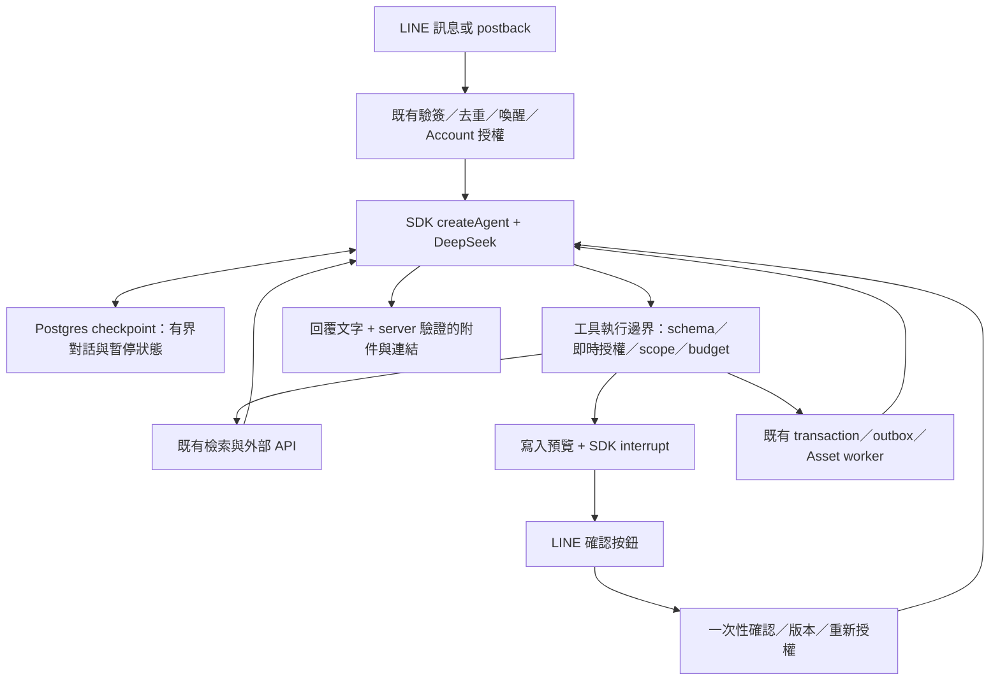

# SDK agent harness 改造設計與分析

日期：2026-09-04。狀態：主要產品方向已確認；SDK mechanics probe 14/14通過，真實DeepSeek 4個synthetic情境各跑3次，工具選擇與寫入暫停均符合預期。實作尚未開始。證據見 [feasibility report](../research/2026-09-04-sdk-agent-feasibility.md)，分階段工作見 [implementation plan](../plans/2026-09-04-sdk-agent-redesign.md)。

分析基準：`origin/main` 的 `04d085646bb40f4386afa4243401542926b5f39b`。2026-09-04 再次比對遠端 main，仍為相同 commit。分析分支：`codex/hermes-agent-redesign-analysis`。

## 1. 建議決策

採用 **LangChain JS `createAgent` + LangGraph checkpointer + DeepSeek 原生 tool calling** 作為 helper 的 agent harness。SDK 負責模型／工具循環、訊息狀態、暫停恢復與標準 middleware；本專案維護 LINE 入口、Account 授權、工具的業務實作與資料安全。

不再維護候選函式排名、一次性 JSON planner、語意信心門檻、單一 capability 對話狀態機。也不以手寫 LangGraph 節點重做同一套路由器。新增的是 SDK 整合與必要的業務邊界，移除的是自製 agent orchestration。

這是本專案的最佳適配，而不是抽象上的唯一最佳框架。已發布套件的14項 mechanics probe全部通過；真實DeepSeek小型live gate也證明跨正式表／筆記、一般聊天、多步找譜與寫入暫停可行。完整產品改善仍需實際 adapters 與30×3驗收，不能只因框架名稱或小型測試宣稱完成。

使用者已確認：Hermes、OpenCode、OpenClaw、Codex、Claude 是 agent 體驗的範例，並非指定移植某個產品。終局是成熟開源 SDK 支撐的 agent，加上 guardrails 與必要工具。

## 2. 真正要改善的行為

使用者提供的失敗情境：實際想查服事表，卻很容易沒有呼叫服事表功能；已儲存的資訊也可能包含服事表，造成誤判。

新的產品契約：

- **已確認（2026-09-04）：helper 被喚醒後可一般聊天與回答常識，工具執行與資料存取受權限限制。** 一般對話不必先命中教會 function；需要內部事實時仍須查詢授權來源，不能憑模型記憶回答排班。這項決策不改變入口註冊、群組喚醒及 provider-free main。
- **已確認（2026-09-04）：保留 LINE 直接新增／修改正式服事表的能力。** `save_schedule` 是必要功能，透過新 agent 工具入口整合；保留有效權限、預覽確認、canonical revision 與保存期限。
- **已確認（2026-09-04）：保留外部歌譜搜尋與匯入，改由 agent 協助多步查找。** 使用者期待類似請 coding agent 找歌譜的體驗：調整搜尋、閱讀公開頁面與比對候選。找到檔案後仍沿用既有下載、Asset 送掃與發布流程。
- 使用者描述問題即可，不需要知道資訊存於服事表、記憶或知識庫。
- Agent 可以先查一個來源，看結果後改查或補查其他授權來源；一次請求可使用多個工具。
- 正式服事表與補充筆記需標示差異。較新的筆記不自動覆蓋正式排程；有矛盾時呈現矛盾與時間，不假裝已確認。
- 只有筆記有答案時，可回答「你先前儲存的資訊提到……」，不可聲稱那就是正式排班。
- 查詢不會默默寫入、轉成正式服事表或記錄群組聊天。寫入仍需明確意圖、預覽與確認。
- 允許自然追問、改問與澄清；不要要求使用者挑選內部 function 名稱。

例：使用者問「這週日誰帶敬拜？」。Agent 查正式服事表；若缺資料、使用者提到先前儲存內容，或需要補充，繼續搜尋可見知識／記憶。若日期有兩個合理解讀，詢問日期；不因句子缺少「服事表」三字直接拒絕。

目前未取得上述失敗的去識別化實際 transcript 與當時資料快照，因此以下是**靜態程式支持的原因分析**，不是對特定 production event 的已重現診斷。

### Helper 人設重新審核

目前沒有 `personal.md`、`PERSONA.md` 或 `MEMORY.md`。Helper 人設分散在 `config/profiles.json` 的 `identityLine`、四段 `smallTalk.prompting`，以及 `src/small-talk.ts` 的 template replies；完整 persona 只送入 small-talk generation。改成單一 SDK agent 後若直接沿用，工具回合、一般聊天與 deterministic intro 可能呈現不同角色。

現有人設的優點是繁體中文、第一人稱、溫暖簡短、不說教、不編造教會立場。需要修正的地方：

- 「熟悉家教會文化、像成熟教會同工」容易讓人誤以為它擁有未查證的內部知識或牧養身分；應明示它是數位協作助理，不代表牧者、同工或教會正式立場。
- persona、conversation、safety、format規則目前混在一起。未來全域persona若直接沿用「不要網址／Markdown」，會和檔案連結、來源引用、結構化工具結果衝突。
- 人設只規範small talk，沒有統一「查不到資料、正式來源與筆記衝突、工具失敗、等待掃描」時的說話方式。
- `identityLine`、template copy及LLM prompt有重複身份文字，修改時容易漂移。

實作時建立 `config/agents/helper/PERSONA.md` 作為 helper 唯一的LLM角色與語氣來源；使用 `PERSONA` 而非 `PERSONAL`，因為檔案描述bot角色，不存個人資料。內容維持短而可測：

1. **身份：** 小哈是家教會的數位協作助理，協助找資料、整理、提醒限制與執行經批准的動作；不假裝是人、牧者或正式發言人。
2. **語氣：** 溫暖、穩定、簡潔、務實，以第一人稱「我」回覆；不裝熟、不過度稱呼姓名、不主動講道。
3. **可信度：** 區分模型常識、正式資料、群組筆記與推測。沒有工具證據時不聲稱查過；來源矛盾時說明差異。
4. **關係邊界：** 可以同理及提供一般建議，不診斷、不下屬靈權威判斷、不代表教會對個人的評價。
5. **工具行為：** 自然選工具及澄清；檔案、寫入、掃描、發布等狀態由server projection表達。

Profile config引用該檔，並保留供deterministic intro使用的短`identityLine`與非人格執行設定；loader限制在版本控制的 `config/agents` 目錄，啟動時驗證檔案存在且非空。測試鎖定intro、一般聊天與agent system prompt的身份一致。Main維持provider-free，不載入helper persona。工具權限、確認與資料安全仍由code/domain控制，不移進prompt檔。

### `MEMORY.md` 與群組記憶設計

`config/agents/helper/MEMORY.md` 是版本控制的**記憶政策**，不是持續追加的資料檔。Runtime memory仍存PostgreSQL並沿用scope、visibility、expiry、deletion與audit；容器或Git內不得累積使用者內容。

| 層次                     | 是否自動 | Scope與期限                               | 用途                                                              |
| ------------------------ | -------- | ----------------------------------------- | ----------------------------------------------------------------- |
| Working conversation     | 是       | profile/source/requester；idle約10分鐘    | 只保存bot已受理的direct或被喚醒group回合，支援當下追問            |
| Explicit factual memory  | 否       | private預設；group需明示；30天            | 使用者要求記住的集合、安排、偏好或補充資訊，preview/confirm後保存 |
| Personal preference      | 否       | requester-private；可查看、修改、刪除     | 本人選擇的回覆語言、長短、常用查詢偏好；群組內不得向他人揭露      |
| Aggregate product metric | 可       | profile/group aggregate；無原文、姓名、ID | 計算哪類能力常被使用，供產品改善；不作為agent答案或個人評價       |

「某某人最常問什麼問題」不應預設自動保存。它是可歸因的行為側寫，群組成員通常不會預期bot建立或向他人揭露；也容易把正常求助誤解為個人特徵。替代設計：

- 若目的是讓bot更適合本人，使用者在direct chat明確選擇私人偏好，例如「記住我通常要簡短版」。本人可列出、刪除或關閉；在群組中只影響回覆方式，不揭露偏好內容。
- 若目的是改善產品，只記錄無法回推出個人的群組／profile層級function counts，例如「最近常查服事表」，不記誰問、原句、LINE ID或答案內容。
- 若群組直接對bot說出穩定的共同作業事實，agent最多提出一個`save_memory`預覽；只有具寫入權限的人確認後才保存為group memory。第一版仍採explicit-only，取得實際噪音與價值證據後才啟用主動提案。

禁止自動形成或推斷：健康／心理／財務／家庭／關係／信仰狀態、未成年人資訊、個人能力評價、誰最常求助、誰較少參與、群組成員排名，以及未直接對bot說話的群聊內容。`MEMORY.md`不能放寬這些code-level限制。

## 3. 現況與主要問題

| 現況                                                        | 程式證據                                                                                                    | 改善含義                                                      |
| ----------------------------------------------------------- | ----------------------------------------------------------------------------------------------------------- | ------------------------------------------------------------- |
| DeepSeek 只接收 system/user，回傳文字或 JSON                | `src/clients/deepseek.ts` 的 `completeJson`、`completeText`；未處理 `tools`、`tool_calls`、工具結果 history | 現在不是 SDK 驅動的多步工具循環                               |
| 模型之前先用文字／metadata／active-task evidence 篩選與排名 | `src/agent/capability-candidates.ts`；helper `maxCandidates: 3`                                             | 未入選的工具沒有機會由模型探索                                |
| Planner 只提案，再經語意與權限混合 validator                | `src/agent/planner.ts`、`plan-validator.ts`、`controlled-agent-router.ts`                                   | 保留授權與 schema；移除語意正確性的規則防火牆                 |
| 檢索工具被寫成互斥意圖                                      | `src/functions/definitions.ts`：knowledge 避讓 schedule；memory 只在明確提及記得／儲存時使用                | 直接妨礙「存成筆記的服事資訊」被找到                          |
| `currentCapability` 主導單一 active task                    | `src/agent/active-task.ts`、`active-task-transition.ts`                                                     | 改用 SDK 訊息與工具結果，多來源追問不再依單一 capability 決定 |
| 有 context 管理程式，但沒有接成完整模型對話                 | `createContextManager` 僅測試引用；`recentTurns()` 未找到 production caller                                 | 刪除無效抽象，真正接上有界訊息 history                        |
| handler 多半直接產生最終回覆；部分又各自呼叫模型            | knowledge、memory、Wikipedia handler 與 turn runtime                                                        | 讀取工具回傳證據，agent 統一整理；减少重複摘要與語意丟失      |
| 通訊與 orchestration 仍很大                                 | webhook routes 約 2,572 行；turn runtime 約 1,380 行                                                        | 以移除 orchestration 降低複雜度，不再增加一層 coordinator     |

`src/server.ts` 現為 compatibility export；AGENTS 所列 `src/router.ts` 已不存在。管理員／Account 描述也有新舊不一致處。文件必須隨改造更新，避免新實作又被過期規則帶回舊設計。

框架無法修復「資料根本沒同步、索引過期、權限設定錯、日期解析錯」等問題。驗收應分開記錄工具是否選對、工具是否取到證據、答案是否忠實，才能判斷下一個修正點。

## 4. SDK／framework 選型

2026-09-04 查詢 npm metadata，並將以下正式發布套件安裝在 throwaway 目錄檢查 manifest、型別及實作；未加入專案依賴。LangChain、DeepSeek adapter、PostgresSaver、Node 24與Zod 4組合已完成 mechanics/live probe；正式實作仍須寫入專案 lockfile並通過完整 build。

| 方案                                   | 研究版本／license                 | 能接手的工作                                                              | 本專案判斷                                                                                             |
| -------------------------------------- | --------------------------------- | ------------------------------------------------------------------------- | ------------------------------------------------------------------------------------------------------ |
| LangChain JS `createAgent` + LangGraph | `langchain@1.5.10`／MIT           | 模型工具循環、messages state、HITL、checkpoint、middleware                | **採用**。已通過本案mechanics與小型DeepSeek live gate；能嵌入Fastify並取代自建graph routing            |
| Vercel AI SDK `ToolLoopAgent`          | `ai@7.0.91`／Apache-2.0           | 模型工具循環、工具 approval、停止條件、provider 整合                      | 次選。API 精簡，但本案跨 LINE event 的持久狀態、恢复與生命週期仍需較多整合                             |
| Mastra                                 | `@mastra/core@1.64.0`／Apache-2.0 | Agent、memory、workflow、approval、平台整合                               | 若需要整套 agent 平台再考慮；目前 LINE／Fastify／DB 已存在，需避免再建一套服務與狀態體系               |
| Deep Agents JS                         | `deepagents@1.13.2`／MIT          | LangChain/LangGraph 上的 harness，含檔案系統、subagent、摘要與可選 skills | 功能完整，但第一版查詢／寫入工具不需要檔案工作區與委派。可以限制內建工具，卻仍要理解並維護額外預設堆疊 |

LangChain `createAgent` 提供現成 agent loop；LangGraph checkpoint 用於執行狀態，HITL middleware 用於暫停待審工具。這些符合本案不再自製 loop 的方向。[Agents](https://docs.langchain.com/oss/javascript/langchain/agents)、[Persistence](https://docs.langchain.com/oss/javascript/langgraph/persistence)、[HITL](https://docs.langchain.com/oss/javascript/langchain/human-in-the-loop)

AI SDK 的已發布 `ToolLoopAgent` 會驅動工具循環並在 approval／停止條件退出；這是有效的輕量替代案。跨事件 checkpoint 的整合負擔是本案取捨，並非宣稱 AI SDK 無法實現。[官方原始碼](https://github.com/vercel/ai/blob/main/packages/ai/src/agent/tool-loop-agent.ts)

Mastra 官方區分可續接 stream 與 backend crash 後的 durable execution；不能把瀏覽器斷線後繼續讀 stream 當作寫入 exactly-once。其介紹中的 crash recovery 方案涉及 `createInngestAgent`，需另外評估部署依賴。[Durable Agents](https://mastra.ai/blog/introducing-durable-agents)

Deep Agents 的預設 harness 提供虛擬檔案系統與 subagent，底層也是 LangChain/LangGraph。發布版 `createDeepAgent` 原始碼確認會組合相關 middleware；不是傳入空 `tools` 就只有空工具集。[Deep Agents overview](https://docs.langchain.com/oss/javascript/deepagents/overview)

OpenCode SDK 主要是控制 OpenCode server 的 client；直接使用會把完整 coding runtime 帶進 LINE 服務。Hermes 也有 programmatic integration，但仍應評估完整 runtime 與 TypeScript 服務間的成本。因此將它們作為體驗參考，不預設整個移植。[OpenCode SDK](https://opencode.ai/docs/sdk/)、[Hermes integration](https://hermes-agent.nousresearch.com/docs/developer-guide/programmatic-integration)

### DeepSeek 接法與限制

- 使用 `DEEPSEEK_API_KEY`，由 ACA secret／local env 注入；沿用 DeepSeek-only 語意 provider 方針。
- 先驗證 `@langchain/deepseek` 與選定 model 的 tool call、工具結果回傳、多次呼叫、取消、usage。採用當次驗證過的確切版本與 lockfile，不照抄舊文件範例。
- DeepSeek 官方已支援原生 tool calling；strict schema 仍是 beta，不能代替 server 端 schema／授權檢查。[DeepSeek tool calls](https://api-docs.deepseek.com/guides/tool_calls/)
- LangChain 有 DeepSeek integration，但文件含較早的 reasoner 限制說明，需以目前 provider 規格和實際相容測試為準。[ChatDeepSeek](https://docs.langchain.com/oss/javascript/integrations/chat/deepseek)
- 第一個驗證維持非 thinking 模式，減少同時變動。若品質不達標，再用同一評測比較 thinking 的效果、延遲及成本；不是增加另一個 fallback provider。
- 現有 Azure embedding 用於索引檢索，與對話 provider 是不同職責；此改造不要求重建 embedding／pgvector。
- 不要求 LangSmith、模型 gateway 或託管 agent 平台；預設不啟用會外傳內容的 tracing。
- SDK agent 僅在 `helper` profile composition 建立。`main` 不建立模型 client、不看 agent tools、不寫 checkpoint，原有週報下載與本人資料更新仍走 provider-free deterministic path；以 `providerRequests: { deepseek: 0, embedding: 0 }` 回歸鎖定。

## 5. 目標架構與 guardrails

### 責任分界

| 工作                                                                    | 負責者                                         |
| ----------------------------------------------------------------------- | ---------------------------------------------- |
| 理解意圖、選工具、整理證據、判斷下一步與提出澄清                        | DeepSeek，經 SDK loop 執行                     |
| tools/messages 協議、循環、checkpoint、interrupt/resume、標準限制與摘要 | SDK 及官方 middleware                          |
| LINE profile/source/requester、工具可用集合、權限、資料範圍             | 本專案，依已驗證的 runtime context 注入        |
| 寫入 preview、一次性確認、revision、idempotency、outbox                 | 既有 domain/儲存邊界；SDK 暫停與恢復連接此邊界 |
| 檢索品質、資料同步、正式來源、retention、分享連結生成                   | 既有 domain/adapter，逐項簡化                  |

Guardrail 的權威是 server，可被模型理解，但不依模型服從才生效：

1. **工具可見性和執行都檢查權限。** 按 profile、有效 Account permission 與 LINE source 建立小型工具集；不再按問句 regex 選前三名。執行、續問和确认时重新檢查，可見工具並不是長期授權。
2. **Identity 不在 tool arguments。** profile/source/requester 由服務注入；opaque ref 也要解析並驗證 scope、期限與當下授權。禁止模型自行指定別人的 user/group ID、任意 DB query 或儲存位置。
3. **工具 schema 定義業務資料。** 日期範圍、筆數、enum、修改欄位依 schema 驗證；錯誤作為可修正的 tool result。模型可重試一次修正參數，但沒有無限循環。
4. **寫入需要 server-bound approval。** 模型不能傳 `confirm: true` 取得授權。預覽綁定完整參數、requester、來源、revision、期限；LINE 確認原子消耗一次，再 resume。修改預覽後必須重新確認。SDK approval 本身不代表 Account 授權或 exactly-once。
5. **不可信內容只當資料。** Wikipedia、Notion、記憶不能改寫系統規則或授權。工具出口限制來源、內容大小及欄位；不提供任意 HTTP/shell/SQL 工具。Prompt injection 測試驗證權限邊界，即使模型被誘導也不能越權。
6. **有界執行。** 使用官方 model/tool call limit、timeout、取消與摘要 middleware。實際SDK多步找譜probe需要5次模型呼叫；第一個live gate改以每回合最多6次模型、6次工具呼叫作測量起點，write tool仍最多1次。包括重試、平行呼叫、resume後的累計都要驗證。這是暫定值，不是既有效能承諾。[Prebuilt middleware](https://docs.langchain.com/oss/javascript/langchain/middleware/built-in)
7. **結果與 telemetry 分開。** 模型可以收到已授權、必要的資料片段；一般 trace 僅記工具名、狀態、耗時、token、拒絕原因。不得把整個 SDK run／prompt／tool result 直接送入 log。
8. **生命週期文字由 server 投影。** 真實DeepSeek正式三輪找譜中有1輪過度承諾「已找到可下載」，前導輪也發生同樣問題。候選、已送掃、clean、已發布、已寫入與分享連結一律依typed domain result生成；模型不能覆寫該狀態。

新工具結果可包含 `status`、有界 evidence、來源種類、更新時間與 opaque references。`not_found`、`unavailable`、`ambiguous`、`stale` 必須區別，不能解析使用者回覆文字判斷成功與否。分享網址由 server 在送出時生成／驗證，不放入 checkpoint，避免存入過期連結。

### 對話、隱私及恢復

- 同一 profile/source/requester 建立獨立 SDK conversation。群組沒有 requester ID 時不建立可續接狀態，也不读取其他人的訊息。
- 只記錄 bot 已受理的互動，維持群組喚醒窗口；不因引入 checkpoint 自動收集群聊。
- 用既有 PostgreSQL 的官方 checkpointer adapter；Redis 保留去重、rate limit、短期 selection、確認等既有責任。無需新增 Redis/DB 服務。
- Checkpoint 可能含授權內容，屬敏感業務狀態，不能沿用「trace 只有 metadata」的假設。需實作有界 retention、刪除、過期後不可 resume，並驗證 child checkpoints 一併清除。
- 對話內容目前多於一次性 planner，這是明確的資料處理變更。工程預設沿用 `agentRuntime.taskFrameSeconds` 作為 idle TTL（現有預設600秒）；每次受理互動刷新期限，過期立即禁止 resume，5分鐘週期清除過期的完整 checkpoint chain。部署後首次啟動也清理逾期 chain。資料庫備份期限不因此改變，不把邏輯到期說成備份同步抹除。群組喚醒仍用現有60秒窗口，顯式 memory 仍為30天。
- 權限撤銷或來源失效時，舊 checkpoint 的內容可能已不再允許讀取；下一次送模型前必須失效該對話或重新建立授權後的安全上下文，不能只阻止下一次 tool call。
- 同一 conversation 的併發 LINE event 需序列化；使用既有可用的原子機制，否則以 Redis token lease 的最小實作保護。必須測試 lease 過期與 stale writer，不能把 checkpoint 當互斥鎖。
- 短讀取超時可重新查；寫入透過既有 transaction／idempotence／outbox。外部寫入成功、checkpoint 未保存的 crash window 必須有測試。
- SDK checkpoint 不會自己喚醒 process。已暫停的 approval 由下一個 LINE event 恢復；長任務的啟動與回復仍需可靠工作入口。沿用現有工作儲存與 postback 結果領取，先確認其實际 runner 保證，不另建任意背景 agent 平台。
- LINE 不需要展示 token stream。回覆仍受 LINE reply 時限與既有短任務／結果領取模式約束；長工具循環不使用 push quota。延遲驗收含真實 LINE 回覆，不以 HTTP 200 代替。

## 6. 全部 function 的處置建議

「合併」指模型使用的工具與重複實作；不代表合併不同權限或直接搬動資料表。這是經repo-wide dependency/complexity audit後的最小合理 surface，但未取得功能使用量，也尚未接實際 adapters，因此是執行目標，不宣稱已達最終實測最佳值。

| 現有 function           | 建議                                                           | 必要改善與保留邊界                                                                                                                 |
| ----------------------- | -------------------------------------------------------------- | ---------------------------------------------------------------------------------------------------------------------------------- |
| `query_schedule`        | **保留**，正式服事資料查詢                                     | 保留 domain/date/role 與 canonical source；移除問句關鍵字准入；由 typed result 取代文字判斷。可和筆記搜尋共同使用                  |
| `query_knowledge`       | **合併模型入口**至 `search_information`                        | 保留 Notion sync、FTS、pgvector、原子 snapshot、到期与來源管理；回傳證據讓 agent 回答，移除 handler 的第二次摘要模型呼叫           |
| `retrieve_memory`       | **合併模型入口**至 `search_information`                        | 保留 requester/source visibility 與30天期限；不再要求問句明示「你記得」；不可讀到別人的私人 memory                                 |
| `find_ppt_slides`       | **合併模型入口**至 `search_files` 的 `kind=presentation`       | 保留檔案格式、授權 catalog、分享期限；與歌譜共用搜尋、選擇及安全分享流程                                                           |
| `find_sheet_music`      | **合併內部搜尋入口，保留 agent 外部查找**                      | `search_files(kind=sheet_music)` 查內部；agent 可多步外部搜尋、讀頁與比對版本，選定檔案後沿用確認、送掃與匯入                      |
| `find_resource`         | **合併模型入口**至 `search_files` 的 general／unspecified kind | 保留授權一般 catalog；統一多結果選擇，避免此功能只能要求重講、其他功能可選項                                                       |
| `query_wikipedia`       | **保留**                                                       | 已存在，不必另造 web agent；查詢與讀取限 Wikipedia，候選歧義可澄清；返回來源及片段，由 agent 摘要                                  |
| `save_schedule`         | **已確認保留**                                                 | LINE 直接新增／修改正式服事表是必要需求；整合 SDK 工具呼叫，保留授權、preview/confirm、canonical revision、retention               |
| `save_memory`           | **保留明確保存文字**                                           | 明確區分短期對話與顯式筆記；有預覽、確認、visibility。可保存服事資訊，但不自動升格為正式服事表                                     |
| `save_resource`         | **保留，拆清操作語意**                                         | 附件／外部檔案匯入沿用 worker／Asset／scan／outbox；HTTPS 書籤先保留30天與原可見範圍，以明確操作欄位區分，禁止把存書籤當成下載匯入 |
| `download_weekly_paper` | **保留 main 的固定入口**                                       | 公開週報下載不需要模型；維持 provider-free                                                                                         |
| `update_own_profile`    | **保留 main 的自助入口**                                       | direct-only、linked active caller、即時 Account check、preview/confirm；第一版不搬入 helper agent                                  |

Helper 原有功能整理為 `query_schedule`、`search_information`、`search_files`、`query_wikipedia`、`save_schedule`、`save_memory`、`save_resource`。依 agent 歌譜查找需求，再提供外部搜尋與讀頁兩個唯讀工具，共 **6 個讀取 + 3 個寫入**。公開 main 的兩個功能及管理動作分開。不要為追求更少工具，把search/read或不同副作用重新藏回大型handler；實作後以tool telemetry決定是否還能合併或應拆分。

合併工具時必須按子操作保留原授權：例如只啟用投影片、不啟用歌譜的 profile，`search_files` 仍不可搜尋歌譜；`search_information` 也只查当下启用與可見的資料來源。不要因工具名稱較少而放大權限。

Admin/system actions 另行整理：保留登入、註冊、help、診斷、invite、knowledge source lifecycle 等實際需求。自然語言管理能力只有已驗證 direct admin 才加入工具集，handler 仍經 action catalog、audit 與 destructive confirmation。管理功能不混進一般 `enabledFunctions`。

### 跨來源檢索與保存方式

`query_schedule` 提供正式結構化查詢；`search_information` 將既有 knowledge 和可見 text memory 搜尋包在單一工具下。兩者不是互斥路線，由 agent 看問題與結果決定使用哪個或兩者。

初期不建立新的 federated-search framework，不搬動 memory／knowledge／schedule 資料表。搜尋工具只組合既有檢索並回傳有來源的有限候選；rank、上限、來源失效與跨來源同分仍有明確契約。

「幫我記住這份服事資訊」預設存筆記，並在預覽標示；明確要求新增／修改排班時走結構化預覽。使用者不必說出「正式服事表」或 function 名稱，例如查詢後說「把這週司琴改成另一位同工」即可提出修改預覽。若修改目標或保存意圖不明，詢問必要資訊；預覽清楚列出目標服事表與差異，確認前不得寫入。

### Agent 協助外部歌譜查找

現有 `runExternalSheetMusicSearch` 把問句加上「歌譜」後只搜尋一次，隨即摘要候選並進入 selection。`src/search/sheet-music-external-summarizer.ts` 明確只整理 title/snippet/url，不能宣稱讀過網頁。`src/clients/searxng.ts` 提供搜尋結果，沒有頁面閱讀能力。新設計需要補上讀頁與反覆調整查詢，不能只把這段 handler 包成工具就稱作 agent 搜尋。

由同一個 SDK agent 使用工具完成以下流程；這是可調整的查找策略，不新增一套固定搜尋狀態機或子 agent：

1. 查內部 catalog，理解曲名、作者、語言、編制等已提供條件。條件不足且會選錯曲目時才澄清。
2. 在已授權的外部搜尋範圍內，搜尋曲名／作者／別名等公開資訊，必要時換關鍵字繼續找。
3. 開啟候選公開頁面，判斷是歌譜、歌詞、商品介紹或可取得的檔案，並可繼續追蹤頁面提供的公開連結。不是只把搜尋摘要轉貼給使用者。
4. 回傳少量有來源的候選，說明已查證的版本／編制／格式，以及仍不確定之處；使用者可追問「我要合唱版」「再找別的來源」，由 agent 接續搜尋。
5. 使用者選定可匯入的檔案並確認後，透過 `save_resource` 接既有 durable outbox。仍由 worker 下載，Asset 掃描與驗證，取得 clean 狀態後才發布及 catalog upsert。Agent 不下載二進位到 bot process，也不建立第二條發布路徑。

**沿用項目已確認：** opaque work ID、權限與預覽確認、外部安全下載、Asset lifecycle、checksum／size／MIME、重試與 lease、clean-only publication、結果 postback。找到候選頁面或 PDF 網址不代表檔案已送掃、已安全或已匯入；回覆須依各階段實際結果表達。

外部搜尋與讀頁可由 agent 多次呼叫；匯入仍為独立受確認的寫入。原有第一次外部搜尋 consent 先保留，同意後本次查找範圍內不必每換一個關鍵字或開一頁就重問。是否將一般「幫我找歌譜」直接視為同意外部搜尋，是後續可調整的產品規則；本次不默默取消既有 consent。

第一版網頁能力限歌譜查找所需的公開搜尋與頁面閱讀，不增加登入網站、購買或任意 shell。讀頁限已驗證的公開 URL／結果 reference，限制內容大小、連結追蹤、redirect、耗時與總呼叫；內網／保留位址不得讀取。外部查詢只提供必要搜尋條件，不傳完整內部資料或對話。網頁內容不能變更工具權限，也不能指示匯入其他檔案。

頁面對調性／編制的描述與真正辨識樂譜內容是不同能力。未配置或驗證可讀該檔案的解析／視覺能力時，只回報可查證的頁面資訊，不宣稱已看懂掃描樂譜。遇到需登入／付費或不可直接取得檔案的頁面，提供來源及限制；不把 HTML 交給原本只接受 PDF/JPEG/PNG 的匯入流程。

實作優先沿用 SearXNG 搜尋，並在 spike 選一個成熟的公開頁面讀取整合，避免自製 crawler。可評估 LangChain 的 `TavilyExtract`／Tavily JS SDK，其提供 URL 內容擷取；這是額外的搜尋／讀頁服務，需 API key 與成本評估，尚未選用或安裝，不改變 DeepSeek 是唯一語意模型 provider 的要求。[Tavily JS SDK](https://docs.tavily.com/sdk/javascript/quick-start)、[LangChain TavilyExtract](https://docs.langchain.com/oss/javascript/integrations/tools/tavily_extract)

若真實案例證明需要 JavaScript 互動才能取得公開資料，再評估成熟 browser tool；第一版不預設架設完整瀏覽器服務。現有一次性外部搜尋 summarizer 在 agent 統一閱讀／回答後退役。多步找譜probe實際用了5次模型、4次工具，live起點改為6/6；耗時任務走既有結果領取方式，不能為硬塞 inline reply 而退回一次搜尋。

## 7. 刪除與保留清單

| 順序 | 範圍                                                                               | 處理方式／條件                                                                                            |
| ---- | ---------------------------------------------------------------------------------- | --------------------------------------------------------------------------------------------------------- |
| 1    | `capability-candidates.ts`、`planner.ts`、`controlled-agent-router.ts`             | SDK 切換時整段移除 production 路由依賴，不保留第二套 router                                               |
| 1    | `plan-validator.ts` 及 lexical evidence helpers                                    | 先抽出真正 schema/auth/source/side-effect 邊界，再刪 semantic gating、confidence rescue 與 phrase routing |
| 1    | active-task currentCapability／transition、generic slot orchestration              | SDK 接手訊息與澄清；保留 opaque ref validation、selection 一次性消耗等安全邏輯，不原封不動包成 middleware |
| 2    | handler 內 knowledge/memory/Wikipedia 摘要                                         | 改成 evidence tool result 後移除重複 LLM 呼叫                                                             |
| 2    | `src/application/turn/runtime.ts`                                                  | 刪受取代的語意階段，留下 LINE→agent→reply 的薄整合，不把1380行移到另一檔案                                |
| 2    | `src/agent/context-manager.ts` 的未用 context builder、provider lane/fallback 抽象 | 以 caller 與 config 檢查確認無用途後移除；有使用中的 wake-window store 不連帶刪除                         |
| 3    | 檔案搜尋、selection、sharing 重複路徑                                              | 合併實際共同處；不同來源 adapter 不硬湊成泛型 framework                                                   |
| 3    | 舊 routing eval、fixtures、config knobs、文件                                      | 將仍有效的安全／產品案例遷入新驗收；只驗證已刪機制的測試一併退役                                          |
| 4    | compatibility facade、過期文件導覽                                                 | 消除無效參考；小型 re-export 不是主要減碼價值，放最後                                                     |

必須保留：LINE webhook 驗簽／event 去重、Account live authorization、profile/source/requester scope、Redis 原子流程、DB retention／publication 原子性、Asset malware 流程、durable outbox、media-sync、public main、provider-free release assurance。

舊 user/group grant、role-capability tables 已有 rollback 保留要求；不可跟著 routing cleanup 直接 drop。新的 checkpoint schema 採新增方式，列出保留期限與清除作業；資料退役另作經核定的 migration。

不先承諾精確刪除幾千行。每個 PR 回報 production LOC、重複模型呼叫數、runtime control points 與保留安全驗收；框架 adapter 不應逐漸長成另一個 planner。

## 8. 執行順序與退出條件

以下是產品方向確認後的實作順序；本次沒有執行這些修改。以同一改造分支或 stacked PR 累積，最後做一次完整 runtime 切換；不把尚未完整的 SDK路徑部署為另一套長期開關。

### A. 固定產品驗收與基準

產物：去識別化案例集、期望證據／允許副作用／範圍、目前版本同條件結果。至少涵蓋第9節案例，以及使用者後續提供的真實說法。

用相同模型與資料快照比較；先跑舊版本 live baseline，記錄未呼叫工具、來源缺資料、錯誤答案各自比例。來源根本無資料的案例不混算路由失敗。

### B. SDK spike：先證明能少寫程式

在獨立實驗入口整合 `createAgent`、DeepSeek、`query_schedule` 及唯讀資訊檢索 adapter；另加歌譜外部搜尋／讀頁、多次調整查詢的案例，以及無真實副作用的確認案例與 persistent checkpoint。不上 production、不使用真實寫入工具。

必須證明：原生多步 tool call、跨來源問題、自然追問、受限工具集合、LINE式兩次 event 的 interrupt/resume、重啟後恢復、權限變更後上下文失效、取消／預算停止。使用已發布 JS API，不照抄混有 Python 的文件。

退出條件：不再依賴舊 candidate/planner；核心案例達標；未產生自製 routing graph；版本與所有 adapter 相容；模型／schema／checkpoint／確認邊界沒有不可接受缺口。未達標先定位資料、工具描述、模型或 SDK 問題，再決定是否改用 AI SDK 或 Mastra；不重新補 regex router。

### C. 工具與 guardrails 改造

依第6節改讀取 envelope 與合併入口，再接3個寫入 preview/confirmation。可拆成「檢索」、「檔案」、「寫入」三個可審查的提交，但共享一個工具執行授權邊界。

把現有 `confirm` 等內部欄位從模型 schema 移除；adapter 只能由已驗證 approval resume 進入 commit。整合 attachment 的事件流程，不改 Asset／Graph 發布權威。

退出條件：全部原 function 的處置有對應測試或明確核定退役記錄；disabled 子能力、資料 scope、歷史 checkpoint、重複 webhook／confirm 都不能越權或重複寫入。

### D. LINE／state 切換與舊 code 刪除

由 composition root 接新 runtime，替換現有 controlled turn orchestration。先把 Redis 短期狀態與新 checkpoint 分工定清楚，再移除 active-task semantic state，避免雙寫。

切換時：舊短期 task／selection 自然到期或明确失效并请用户重新选择；不得轉成已批准的新 action。進行中的 attachment/outbox 與 durable jobs 繼續沿用原格式直到完成。Profile config 和 permission names 有映射，DB 不破壞性改寫。

退出條件：production runtime 沒有舊 router 引用；README／AGENTS／architecture-context 已反映新權威邊界；全部受影響測試與 CI 綠燈。

### E. 驗證、審查與交付

行為變更執行 `pnpm format:check`、`pnpm typecheck`、`pnpm lint`、`pnpm test`、`pnpm build`、`pnpm architecture:check`，以及更新後的 agent/kernel/retrieval-product eval；admin 改動跑 `pnpm eval:admin`。State／publication 改動跑 `pnpm eval:kernel:integration`，不可略過缺依賴。

舊 `eval:agent` 需更新為新 SDK 的工具與安全契約；新 live suite 與 offline tests 分開。不得保留一套只測舊 planner 的綠燈報表當新 agent 驗收。

交付 verified branch/PR、比較報告、migration/rollback 說明。**目前未授權部署**；後續部署需透過既有 PR CI→GitHub Actions release 流程。部署後再做實際 LINE 讀取、確認、群組隔離及長任務領取 smoke。

## 9. 驗收矩陣

| 情境                                        | 通過條件                                                     |
| ------------------------------------------- | ------------------------------------------------------------ |
| helper 被喚醒後一般聊天或詢問常識           | 能自然回答，不因未命中教會 function 拒絕；不必為聊天呼叫工具 |
| 一般對話後改問內部服事資訊                  | 能接續呼叫授權工具，使用實際證據回答；一般聊天不增加任何權限 |
| 「這週日誰帶敬拜？」未提服事表              | 日期可解析時取得正式服事證據，無需內部關鍵字                 |
| 正式表沒有，但可見筆記有相關安排            | 能找到並標明筆記來源；不說正式排班已確認                     |
| 正式表與記憶內容矛盾                        | 呈現差異及時間，不偷偷選一個當真相                           |
| 「那下週呢？」「只看司琴」                  | 使用有界對話修正查詢，不受前一個 capability 鎖死             |
| 「幫我記住下週的服事資訊」                  | 只產生明確的筆記預覽；確認前沒有寫入                         |
| 「把正式服事表改成……」                      | 重新授權、revision 檢查、預覽、一次確認、一次寫入            |
| 缺日期／對象／同名資料                      | 問必要問題或列候選，不捏造參數                               |
| A 在群組搜尋，B 回「第一個」                | 不延續 A 的私人 task、不可讀取 A 的私人結果                  |
| 喚醒外群組聊天／陌生 attachment             | 不納入 checkpoint、不觸發記憶或附件下載                      |
| 停用功能、revoked permission、已到期 source | 新 tool call 和舊 checkpoint/ref 都不能讀取其內容            |
| tool result 內有越權指令                    | 即使模型提案越權，執行邊界拒絕；沒有隱藏寫入                 |
| 重複 LINE webhook／confirm、程序重啟        | 不重複寫入；可識別過期／已完成 approval                      |
| timeout／工具 unavailable／模型無效參數     | 有界退出，區分無資料與不可用，不聲稱已完成                   |
| Wikipedia 歧義與後續追問                    | 能選正確頁面並提供來源，不取得任意網域                       |
| main 下載週報／修改自己姓名                 | 維持 provider-free、self-service 與既有安全行為              |
| intro、一般聊天、工具成功與工具失敗         | 呈現同一helper身份，不冒充牧者或宣稱未查證的教會立場         |
| 群組成員反覆詢問同類問題                    | 不建立具名行為側寫；只允許匿名聚合或本人opt-in私人偏好       |
| 群組直接提供長期共用資訊                    | 第一版不自動保存；明確保存時仍需授權、group preview與確認    |

外部歌譜另納入下列端到端情境：

- 首次搜尋只有歌詞頁：agent 讀頁後改查，找到歌譜候選；不能把搜尋命中當成找譜成功。
- 同曲不同編制：根據頁面證據區分並支援追問；未知調性／版本不捏造。
- 候選是介紹頁而非直接檔案：繼續找公開下載連結；無法取得時提供來源及限制，不將 HTML 當 PDF 匯入。
- 搜尋／讀頁含惡意指令、內網或不安全 redirect：不能擴張工具權限或觸發下載；測試結果 reference 的 requester 與期限驗證。
- 使用者選定並確認：僅 enqueue 一個 opaque work ID，沿用 worker→Asset→clean→publication；掃描 pending／拒絕／失敗時不發布，也不聲稱已匯入。
- 使用者沒有保存權限：仍可查看已授權公開搜尋結果，但不能啟動匯入。長任務、取消、重複確認與 worker 重試仍符合既有契約。

建議第一輪用至少30個具代表性的多輪情境，每個跑3次；其中至少20個是服事表／筆記／知識交錯案例，並納入上述歌譜情境，必要時增加案例數。參數固定，允許不同但合理的工具序列，以最終證據與行為評分。

暫定目標：核心服事情境成功率 ≥95%，全體 ≥90%；未授權讀寫、確認前寫入、跨 requester 洩漏、重複副作用在安全案例中零容忍。此為建議驗收門檻，尚非實測結果或模型保證。

同時報告 p50/p95 延遲、每題模型次數／tool calls／token、無效澄清率、查無資料與來源不可用率。驗收不要求固定第一個 function 名稱；若正確找到資料，允許模型選擇合理順序。成本上限待 live baseline 後設定，不能只拿单次模型 latency 推估整回合。

## 10. 本次已完成與仍待確認

本次完成：最新 main 靜態盤點、全部12個 function 的處置草案、SDK官方資料與發布套件比對、原版本離線基準、14項SDK mechanics probe，以及真實DeepSeek 4個synthetic情境各3次的小型live gate。

| 已執行檢查          | 結果                                             | 證據限制                                      |
| ------------------- | ------------------------------------------------ | --------------------------------------------- |
| `pnpm test`         | 151 files passed；1,897 tests passed；39 skipped | 原版本單元／整合測試集合，不是新 agent 成效   |
| `pnpm eval:agent`   | candidates20/20、proposals14/20、validated20/20  | deterministic offline，不是真實 DeepSeek 決策 |
| `pnpm eval:kernel`  | PASS，115 cases                                  | 原 kernel 契約；不代表使用者不再遇到誤判      |
| SDK mechanics probe | 14/14 PASS                                       | throwaway環境；證明loop/HITL/checkpoint機制   |
| DeepSeek live gate  | 3輪工具選擇與HITL皆符合預期                      | 4個synthetic情境；不是30×3完整產品驗收        |

尚未執行：repo內SDK實作與實際adapter整合、30×3 live benchmark、資料遷移、production變更、release／LINE smoke。

已確認：helper 可一般對話與常識回答；保留 LINE 直接新增／修改正式服事表的 `save_schedule`；保留外部歌譜搜尋與匯入並改為 agent 多步查找；找到檔案後沿用既有送掃與發布流程。工具與資料權限仍由 server 強制執行。這些是產品需求決策，其餘功能退役、實作或部署仍依本計劃處理。

為完成規劃，尚未另作產品選擇的細節採以下可回退的工程預設，不視為使用者逐項核定：

1. 正式表與筆記衝突時標示來源與差異，不自動覆蓋正式表。
2. HTTPS 書籤先保留；本次重點刪除舊 orchestration 與重複實作，沒有無使用證據就移除功能或資料的工作。
3. 對話 idle TTL 沿用現有 task-frame 設定（預設10分鐘），明確實作到期拒絕與清除；顯式 memory 維持30天。
4. 外部查找保留首次 consent；同一查找內 agent 自行換詞與讀頁。只在匯入時再次要求寫入確認。
5. 去識別化失敗對話可持續補充，但目前例子已足夠建立第一批驗收，不以缺少更多例句拖延規劃。

技術選型 gate中的DeepSeek／checkpoint／HITL相容性已由throwaway probe通過。成熟讀頁provider、實際domain adapters、30×3品質與安全gate仍待實作驗證；未通過不能進入production切換。下一步依implementation plan執行；本文件不是已完成實作或已授權production deployment的證明。

## 11. 核心改造穩定後可追加的能力

依YAGNI排序，先利用同一agent組合既有工具；能以多工具流程完成的需求不新增function。

1. **公開網頁研究。** 將目前限歌譜的search/read guardrail擴成一般唯讀公開網頁搜尋，回答附來源；仍封鎖private/reserved address、登入、任意下載與內部資料外送。這是最值得追加的新工具能力。
2. **跨來源比較與摘要。** 例如「比較正式服事表、筆記與知識庫後列出本週差異」或「整理聚會前briefing」。這由現有工具組合完成，不新增function或排程服務。
3. **從訊息產生服事表草稿。** Agent把自然語言或已掃描乾淨的文字內容轉成`save_schedule` preview，逐欄顯示差異後確認；沿用既有寫入工具，不建立第二條import path。
4. **使用者可讀的來源與狀態說明。** 回答「你根據什麼？」或「檔案送掃了嗎？」時，從typed evidence與work status產生簡短說明。這主要是response projection，不需要新agent framework。
5. **受控admin維護。** 把已有knowledge source sync、診斷或invite等動作逐項接成direct-admin-only tools；每項仍走action catalog、audit與必要確認。只有確定管理需求高頻時才做。
6. **私人回覆偏好。** 在direct chat讓本人選擇是否保存語言、長短及常用查詢偏好；這是opt-in memory，不由群組行為推斷。

暫不排入第一批：任意瀏覽器操作、shell、登入網站、購買、主動push提醒、subagent與通用MCP marketplace。它們會擴大權限、狀態或營運成本；等核心agent的實際使用資料證明需求後再評估。
